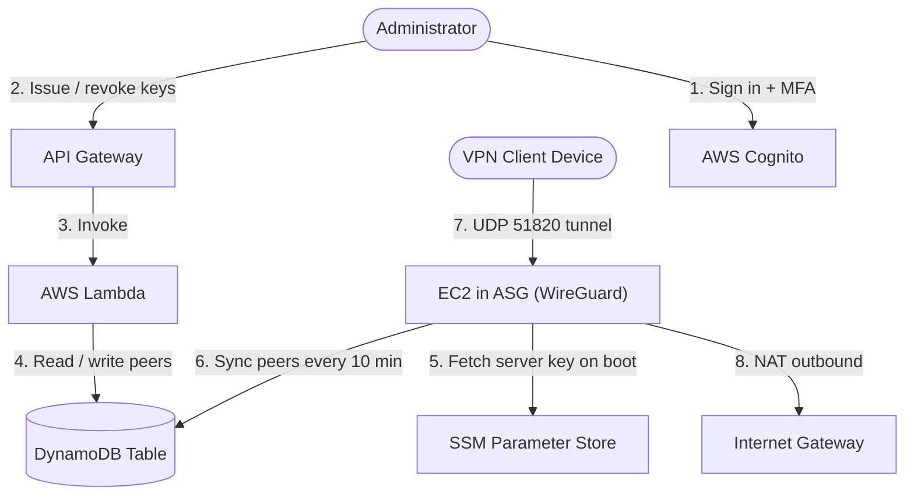

# Pennywire

**A personal WireGuard VPN on AWS that costs about $8–12 a month — and exactly $0 for any region you switch off.**

[](https://developer.hashicorp.com/terraform)
[](https://aws.amazon.com/)
[](./LICENSE)

Pennywire is a complete, self-hosted VPN you own end to end: Terraform brings up a
WireGuard server in any AWS region you enable, a small web app lets you issue and revoke
client keys from your phone, and an Auto Scaling Group quietly rebuilds the server if it
ever dies. There is no control plane to pay for, no load balancer, and no always-on
component beyond one small EC2 instance and its IP address.

The design constraint driving every decision here was cost. Anything that added a fixed
monthly charge — a Network Load Balancer, Global Accelerator, a Route 53 hosted zone —
was rejected in favour of something free, even when the free option was slightly less
elegant. [Design Decisions](#design-decisions) explains what got cut and why.

---

## Table of Contents

- [Why self-host](#why-self-host)
- [Architecture](#architecture)
- [Features](#features)
- [What it costs](#what-it-costs)
- [Prerequisites](#prerequisites)
- [Deploy](#deploy)
- [Connecting a client](#connecting-a-client)
- [Multi-region and the off switch](#multi-region-and-the-off-switch)
- [Operations](#operations)
- [Security posture](#security-posture)
- [Tearing it down](#tearing-it-down)
- [Design decisions](#design-decisions)
- [Repository layout](#repository-layout)
- [Roadmap](#roadmap)

---

## Why self-host

At roughly $8–12/month, Pennywire lands in the same price range as a commercial VPN
subscription, so the case for it isn't purely financial:

| | Pennywire | Commercial VPN |
| :--- | :--- | :--- |
| **Monthly cost** | ~$8–12 per active region, $0 when off | ~$5–12 flat |
| **IP address** | Dedicated, yours alone | Shared with thousands of users |
| **Trust model** | You own the server and the logs | You trust the provider's policy |
| **Geo-unblocking** | Rarely blocklisted (AWS IP, but not a known VPN range) | Frequently blocklisted |
| **Streaming / anonymity** | Poor — a static IP tied to your AWS account | Better, by design |
| **Setup effort** | ~20 minutes and an AWS account | Download an app |

Self-hosting is the right call when you want a trustworthy tunnel out of hotel and café
Wi-Fi, a stable IP for allowlisting, or a way to reach home-region services while
travelling. It is the **wrong** call if you want anonymity: your traffic exits from an
address registered to your own AWS account. See [Security posture](#security-posture).

---

## Architecture



Two loops keep the system running without a human in it. The **boot loop** means a fresh
instance pulls its private key from SSM, rebuilds `wg0.conf`, and re-attaches the Elastic
IP to itself — so a replacement server is reachable at the same address your clients
already have. The **sync loop** is a cron job that reads the peer list from DynamoDB every
10 minutes and applies it with `wg syncconf`, which updates peers **without dropping
active tunnels**. Adding or revoking a client never interrupts anyone else.

Full detail lives in [Architecture & Design](./.agents/rules/architecture.md).

---

## Features

**Self-healing, not highly available.** A single instance sits in an Auto Scaling Group
pinned to `min = max = desired = 1`. Hardware failure or a crashed boot script triggers an
automatic replacement in about 2–3 minutes, and the Elastic IP follows it. This is
deliberately not a redundant multi-instance setup — that would double the bill.

**Per-region on/off switches.** Each region is a boolean in `terraform.tfvars`. Off means
Terraform destroys everything in that region including the Elastic IP, so an idle region
costs nothing at all rather than quietly accruing charges. Turning one back on takes a
couple of minutes.

**Browser-based key management.** A React app behind Cognito lets you name a device,
generate its keypair, and download a ready-to-import `.conf`. The private key is generated
in your browser with `tweetnacl` and never touches the network or the server — only the
public key is uploaded.

**No SSH.** Port 22 is closed. Administrative access, when you need it, goes through AWS
Systems Manager Session Manager.

**Cost guardrails built in.** An AWS Budget scoped to the project's cost-allocation tag
emails you on actual or forecasted spend above $25/month, catching runaway data transfer
before the invoice does.

**Centralized logs and metrics.** Instances are disposable, so syslog and kernel logs
stream to CloudWatch Logs (`/vpn-server/syslog`, 30-day retention) and a CloudWatch
dashboard tracks network throughput, CPU, and status checks.

**Safe state.** Terraform state lives in a versioned, encrypted S3 bucket with a DynamoDB
lock table, both created by a one-time bootstrap.

---

## What it costs

Only three things bill by the hour. Everything else is free or priced per-request at
volumes a personal VPN never reaches.

| Component | Rate | Monthly (730 hrs) |
| :--- | :--- | ---: |
| EC2 `t3.micro` (default) | $0.0104/hr | $7.59 |
| EC2 `t3.nano` (cheapest) | $0.0052/hr | $3.80 |
| EBS root volume, 8 GB gp3 | $0.08/GB-month | $0.64 |
| Elastic IP | $0.005/hr | $3.65 |
| Outbound data transfer | $0.09/GB after 100 GB free | usage-dependent |

**Totals per active region:** about **$11.88/month** on the `t3.micro` default, or about
**$8.09/month** if you set `instance_type = "t3.nano"`. A disabled region is **$0.00**.

Free at this scale: the VPC, subnet, internet gateway, route tables and security groups;
Lambda (1M requests/month free forever); API Gateway (admin traffic is a few requests per
session); DynamoDB on-demand (the sync job scans roughly 4,300 times a month, under a
cent); Cognito for a single admin; SSM Parameter Store; the first 5 GB/month of CloudWatch
Logs ingestion; the S3 buckets; and the budget itself.

Two caveats worth knowing before you scale up. CloudWatch gives you **three free
dashboards** and Pennywire creates one per region, so past three active regions you pay
$3/month each. And the **Elastic IP bills whether or not it is attached**, which is
precisely why disabling a region releases it instead of parking it.

If your AWS account is still inside the legacy 12-month free tier, 750 hours of
`t3.micro`, 30 GB of EBS, and 750 hours of public IPv4 bring year-one cost close to zero.
Accounts opened after the 2025 free-tier change get credits instead — check the current
[AWS Free Tier](https://aws.amazon.com/free/) page rather than assuming.

Prices are `us-east-1` list prices and are a planning aid, not a quote. Full breakdown in
[Cost & Budgets](./.agents/rules/cost.md).

---

## Prerequisites

- An AWS account with **IAM Identity Center (SSO)** enabled — the step-by-step is in the
  [AWS Setup Guide](./.agents/rules/aws_setup_guide.md)
- [Terraform](https://developer.hashicorp.com/terraform/downloads) **>= 1.5.0**
- [AWS CLI v2](https://docs.aws.amazon.com/cli/latest/userguide/getting-started-install.html)
- [Node.js 18+](https://nodejs.org/) — to build the key manager web app
- `wireguard-tools`, for generating the server key (`brew install wireguard-tools` on macOS)
- A WireGuard client on whatever you're connecting: [official apps](https://www.wireguard.com/install/) for iOS, Android, macOS, Windows, Linux

---

## Deploy

Budget about 20 minutes end to end. Steps 1 and 2 are one-time per AWS account.

### 1. Authenticate

```bash
aws sso login --profile <your-sso-profile-name>
export AWS_PROFILE="<your-sso-profile-name>"
aws sts get-caller-identity   # should print your account ID and assumed role
```

### 2. Bootstrap the Terraform backend

Creates the versioned, encrypted S3 state bucket and the DynamoDB lock table. Run once
per account.

```bash
cd bootstrap
terraform init
terraform apply
cd ..
```

Note the `state_bucket_name` it prints — you need it next.

### 3. Configure the backend and your variables

```bash
cp backend.hcl.example backend.hcl          # set bucket to the name from step 2
cp terraform.tfvars.example terraform.tfvars
```

Both files are gitignored. Fill in `terraform.tfvars`:

| Variable | Notes |
| :--- | :--- |
| `deploy_us_east_1` | `true` to bring up the region |
| `instance_type` | `t3.micro` (default, free-tier eligible) or `t3.nano` (cheapest) |
| `budget_alert_email` | Where spend alerts go |
| `admin_email` | Your Cognito sign-in for the web app |
| `admin_initial_password` | Temporary; you'll change it on first sign-in |
| `wireguard_private_key` | Generate with `wg genkey` |
| `client_public_keys` | Leave empty — issue keys from the web app instead |

```bash
wg genkey   # paste the output into wireguard_private_key
```

The private key is written to SSM Parameter Store as a `SecureString`, and
`terraform.tfvars` never leaves your machine.

### 4. Apply

```bash
terraform init -backend-config=backend.hcl
terraform plan
terraform apply
```

Roughly two minutes. The instance needs another minute or two after that to finish its
boot script and register itself in DynamoDB.

### 5. Build and deploy the key manager

The infrastructure is up, but the web app's S3 bucket is still empty. The app reads its
configuration from a `.env` file at build time, populated from the Terraform outputs.

```bash
cd modules/vpn_server/webapp
cp .env.example .env

# Print the four values to paste in
terraform -chdir=../../.. output
```

Map them across: `api_url` → `VITE_API_ENDPOINT`, `cognito_user_pool_id` →
`VITE_COGNITO_USER_POOL_ID`, `cognito_client_id` → `VITE_COGNITO_CLIENT_ID`, and your
region → `VITE_AWS_REGION`. Then build and upload:

```bash
npm install
npm run build
aws s3 sync dist/ "s3://$(terraform -chdir=../../.. output -raw webapp_bucket)" --delete

# Open this in a browser
terraform -chdir=../../.. output -raw webapp_url
```

Sign in with `admin_email` and your temporary password. Cognito will require a password
change and enrolment of a TOTP authenticator app on first sign-in.

---

## Connecting a client

1. Open the key manager and click **Issue New Key**.
2. Name the device (`iPhone`, `Work Laptop`) and click **Generate**.
3. Download the `.conf` immediately — the private key exists only in that browser tab and
   is never stored. Lose it and you revoke the client and issue a new one.
4. Import the file into the WireGuard app, or display it as a QR code for a phone:

   ```bash
   brew install qrencode          # once
   qrencode -t ansiutf8 < iPhone.conf
   ```

5. Toggle the tunnel on. The server picks up the new peer within 10 minutes; existing
   connections are unaffected.

The generated config routes all traffic (`AllowedIPs = 0.0.0.0/0`) through the VPN and
uses `1.1.1.1` for DNS. Edit `AllowedIPs` in the file if you want split tunnelling.

**Revoking** is the same screen: click **Revoke**, and the peer is gone from the server
within 10 minutes.

---

## Multi-region and the off switch

Each region is a feature flag. To bring one up or take one down, change the boolean and
apply:

```hcl
# terraform.tfvars
deploy_us_east_1 = true
```

```bash
terraform apply
```

Turning a region **off** destroys every resource in it — instance, volume, VPC, and
critically the Elastic IP — so it stops costing anything at all. This is the difference
between "shut down the instance" (still ~$3.65/month for the idle IP) and what Pennywire
does (genuinely $0.00). Turning it back on gives you a working endpoint in about two
minutes, though on a **new** IP address, so clients need an updated config.

Clients hold one profile per region in their WireGuard app ("VPN – US East", "VPN –
Europe") and pick manually. That's a deliberate trade: automatic latency-based routing
would mean Route 53 health checks or Global Accelerator, both of which cost more per
month than the servers themselves.

> **Current state:** only `deploy_us_east_1` is wired up in `main.tf`. The module is
> already parameterized on region and CIDR, so adding a region is a matter of copying the
> module block and adding a matching variable — but the extra regions are not there yet.

---

## Operations

The [Runbook](./runbook.md) has the full procedures. The short version:

**The VPN is unresponsive.** Don't debug the instance — replace it. Terminate it and let
the ASG rebuild:

```bash
INSTANCE_ID=$(aws ec2 describe-instances \
  --filters "Name=tag:Project,Values=vpn-server" "Name=instance-state-name,Values=running" \
  --query "Reservations[*].Instances[*].InstanceId" --output text) && \
aws ec2 terminate-instances --instance-ids "$INSTANCE_ID"
```

Service returns in 2–3 minutes on the same IP, with no client changes.

**Check what happened.**

```bash
aws logs tail /vpn-server/syslog --since 10m
```

A healthy boot shows `Starting WireGuard via wg-quick(8) for wg0`,
`wireguard: WireGuard 1.0.0 loaded`, and `net.ipv4.ip_forward = 1`.

**Watch throughput and health.** CloudWatch → Dashboards → `vpn-server-dashboard`.

More in [Observability & Troubleshooting](./.agents/rules/observability.md).

---

## Security posture

**What's done well.** SSH is closed entirely; the only inbound rule is UDP 51820. The
server's private key lives in SSM Parameter Store as an encrypted `SecureString` and is
fetched at boot, never committed. Client private keys are generated in the browser and are
never transmitted or stored. The admin API sits behind a Cognito JWT authorizer with **TOTP
MFA required**, and its CORS policy is pinned to the web app's own origin rather than a
wildcard. Instance metadata requires IMDSv2 tokens with a hop limit of 1, so a
server-side request forgery bug can't be used to steal the instance role's credentials.
The EBS root volume is encrypted. Secrets stay in gitignored `terraform.tfvars` and `.env`
files, and Terraform state is encrypted at rest.

**Known trade-offs**, stated plainly because they're the kind of thing you should decide
on rather than discover:

- The web app's S3 bucket is **public-read** static hosting. Only compiled assets live
  there — no secrets — but there is no CloudFront distribution or origin access control in
  front of it, and no custom domain.
- The admin's initial password is passed as a Terraform variable and lands in state. Change
  it on first sign-in, which is enforced anyway.

**What this is not.** Pennywire is a private tunnel, not an anonymity tool. Traffic exits
from an Elastic IP registered to your AWS account, and AWS retains its own operational
records. It defends against untrusted local networks and ISP-level snooping. It does not
make you anonymous, and it is a poor choice for evading geo-restrictions.

---

## Tearing it down

```bash
terraform destroy
```

Removes everything except the bootstrap backend, which is protected by `prevent_destroy`.
To remove that too, empty the state bucket, delete the `prevent_destroy` lifecycle block
in `bootstrap/main.tf`, and run `terraform destroy` inside `bootstrap/`.

Afterwards, confirm nothing is left billing:

```bash
aws ec2 describe-addresses --query "Addresses[?Tags[?Key=='Project']]"
```

An empty result means no orphaned Elastic IPs — the most common way a torn-down AWS
project keeps charging you.

---

## Design decisions

Every one of these was rejected on cost, which is the whole point of the project:

| Considered | Why not |
| :--- | :--- |
| **Network Load Balancer** for true HA | ~$16/month fixed — more than doubles the bill before compute |
| **Global Accelerator** for one global IP | ~$18/month base plus premium transfer rates |
| **Route 53 latency routing** across regions | Hosted zone and health-check fees, recurring |
| **Two instances with DNS failover** | Doubles compute, and DNS TTL caching delays failover anyway |
| **Terraform Cloud** for state | Free tier is fine, but S3 + DynamoDB keeps everything in one account |
| **Local state in git** | State holds secrets in plaintext; unsafe to commit |

The chosen alternative in each case — an ASG of one, per-region client profiles, S3 state
with DynamoDB locking — trades some convenience for a bill that stays under $12.

Every resource is stamped via Terraform `default_tags` with `Project`, `Environment`,
`ManagedBy`, and `Owner`, which is what makes both the budget filter and Cost Explorer
breakdowns work.

---

## Repository layout

```
.
├── main.tf                  # Per-region module instantiation behind feature flags
├── variables.tf             # Input variables (region flags, instance type, secrets)
├── outputs.tf               # Values needed to configure the web app and clients
├── budgets.tf               # $25/month spend alert, tag-scoped
├── providers.tf             # AWS provider and default_tags
├── backend.tf               # S3 + DynamoDB remote state
├── bootstrap/               # One-time: creates the state bucket and lock table
├── modules/vpn_server/      # Everything for one region
│   ├── compute.tf           #   Launch template, ASG, Elastic IP
│   ├── network.tf           #   VPC, subnet, IGW, routing
│   ├── security.tf          #   Security group, IAM roles, SSM parameter
│   ├── apigateway.tf        #   HTTP API + Cognito JWT authorizer
│   ├── lambda.tf            #   Key management function
│   ├── cognito.tf           #   Admin user pool with MFA
│   ├── dynamodb.tf          #   Peer registry
│   ├── observability.tf     #   Log group and dashboard
│   ├── userdata.sh          #   Boot: WireGuard, EIP re-attach, peer sync cron
│   └── webapp/              #   React key manager (Vite + Amplify)
├── runbook.md               # Operational procedures
└── .agents/rules/           # Architecture, cost, observability, CI/CD notes
```

---

## Roadmap

- Additional region modules beyond `us-east-1`
- GitHub Actions CI/CD with OIDC auth — `fmt`, `validate`, `tfsec`, and plan-on-PR
  ([strategy](./.agents/rules/cicd.md))
- CloudFront with origin access control in front of the web app bucket, replacing
  public-read S3
- Scripted web app deployment as part of `terraform apply`
- Scheduled shutdown windows to cut cost further on part-time usage

---

## License

[Apache License 2.0](./LICENSE)
